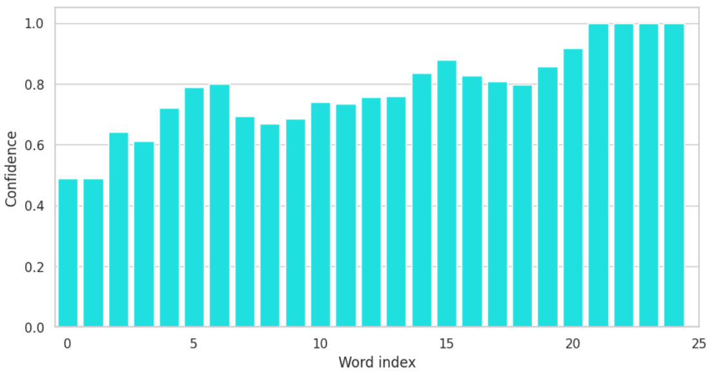
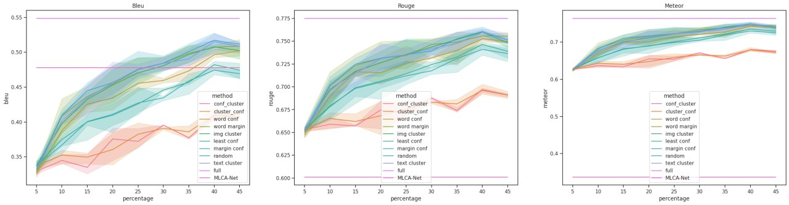

---

<div align="center">    
 
# Active Learning Criteria for Remote Sensing Image Captioning     
<!--  
[](https://www.nature.com/articles/nature14539)
[](https://papers.nips.cc/book/advances-in-neural-information-processing-systems-31-2018)
[](https://papers.nips.cc/book/advances-in-neural-information-processing-systems-31-2018)
[](https://papers.nips.cc/book/advances-in-neural-information-processing-systems-31-2018)  
--> 


<!--  
Conference   
-->   
</div>
 
## Description   
Our final submission for the TU Berlin course "Computer Vision for Remote Sensing" (Winter 22/23).
The goal of our project was to compare different sampling critera for active learning applied to a remote sensing image captioning system. We used an encoder-decoder structure consisting of a Vision Transformer and the GPT-2 language model as our pipeline (https://huggingface.co/nlpconnect/vit-gpt2-image-captioning) and trained it on the NWPU-Captions dataset, the largest remote sensing image captioning dataset consisting of 31500 RGB images with five human produced captions each (https://github.com/HaiyanHuang98/NWPU-Captions).

As an example, this is an image of the NWPU-Captions dataset together with its five reference sentences.


*The stadium is shaped like a ring.*

*The circular stadium is next to the lawn and parking lot.*

*The stadium is next to the grass and parking lot.*

*Many buildings are next to the stadium.*

*There are some green lawns near the stadium.*

We set up an active learning framework which is based on the idea of training in cycles. At each of nine cycles, the model is trained for ten epochs, it is validated on the validation set, and we label a number of samples which corresponds to 5% of the full training set size (that is, of the labeled and unlabeled training data combined). We experimentally tested each of the sampling queries described above.

#### 1. Baseline: Random selection

Simulating an active learning process by randomly sampling from the unlabeled dataset serves as a baseline for the smapling critera.

#### 2. Upper bound: Full dataset

Training on the full dataset without sampling any data gives an upper bound of the performance which can be achieved.

Uncertainty criteria aim to find datapoints closely located to the decision boundary as those might contain features the model has not learned yet and are thus highly informative for the training process.

#### 3. Uncertainty: least confidence

We infer on the unlabeled data and assign each datapoint an uncertainty value which corresponds to the probability with which the prediction was emitted. As in a generated sentence, each word is emitted with a certain probability, we only consider the word which shows lowest confidence. In recurrent sentence generation, later words are emitted with high probability and low variance because they strongly depend on prior words. 



This is why we only consider the word of lowest confidence which is usually located at the beginning of a sentence.

#### 4. Uncertainty: margin of confidence

This sampling criterion works similarly to least confidence sampling, but we measure the confidence of a word as the margin between the probabilities of the most likely and second most likely predictions.

Diversity criteria aim to sample a subset which is as diverse as possible. In practice, this is achieved by extracting features and clustering them using k-means to find structures within the dataset. Then, one sample per cluster is selected to cover a wide range of features.

#### 5. Image diversity

We enforce diversity in terms of image features by clustering the latent vectors produced by the image encoder.

#### 6. Text diversity

We enforce diversity in terms of text features by using the pretrained BERT model (https://huggingface.co/docs/transformers/model_doc/bert) to extract features of the predicted sentences. Those features then processed as described above. 

#### 7. Fusion: Margin of confidence and image diversity

Finding the most uncertain samples and clustering them has the advantage of significantly reducing the cost of the computationally intensive clustering. We concatenated the most successful uncertainty and diversity criteria by first finding the most uncertain samples, clustering them and selecting one random sample per cluster.

#### 8. Fusion: Image diversity and margin of confidence

Similarly, we concatenated the criteria in the reverse order which does not offer the advantage of reduced complexity but can still offer insights into the active learning process. Here, we clustered the image features, randomly selected one sample per cluster, and labeled the most uncertain samples.

#### Results

None of our selected criteria was able to beat the random baseline in terms of our three measured metrics, the BLEU-4, Rouge-L and METEOR scores. While the single criteria achieved results similar to the baseline results, the fusion of criteria worked significantly worse. We have identified a problem in our pipeline which leads to this unexpected behavior but have yet to fix it. In our paper, we propose adjustments to the single criteria and new methods which could be implemented in the future and have the potential of improving the active learning process. Our pipeline proved to be well-suited for the remote sensing image captioning as we were able to achieve test results better than the state of the art after training on the full dataset without active learning. 




## How to setup

Our codebase was developed to run stabily under python==3.9.15. With other releases, unexpected behaviour might occur.

```bash
# clone project   
git clone https://git.tu-berlin.de/wallburg/activelearning_ic.git

# install requirements       
pip install -r requirements.txt
 ```   

## Get the dataset
1. install git lfs following  [this](https://github.com/git-lfs/git-lfs/blob/main/INSTALLING.md)
then

```bash
git lfs clone  https://github.com/lowlorenz/NWPU-Captions.git
tar -xzf NWPU-Captions/NWPU_images.tar.gz -C NWPU-Captions
```  

## How to run

##### Train a model on any CPU or GPU (only single GPU is supported)   
 ```bash
# module folder
cd activelearning_ic

# run training  
python src/main.py --sample_method [SAMPLE_METHOD] --cluster_mode [CLUSTER_MODE] --conf_mode [CONF_MODE] --args
```
##### Train a model on HPC Cluster (only single GPU is supported)
 The slurm scripts for all experiments are provided. Inside the script, 
  ```bash
#SBATCH -o /path/to/output/log
#SBATCH -D /home/dir/activelearning_ic/
```
need to be set.
Start training:
 ```bash
# module folder
cd activelearning_ic

# run module via slurm   
sbatch [SCRIPT_NAME].sh

# monitor output
tail -f [OUT].log
```

##### Parameters for the training

| Name | Default | Type | Description |
|------|---------|------|-------------|
| epochs | 10 | int | Number of epochs to train per cycle. |
| max_cycles | 5 | int | Number of active learning cycles to train. |
| init_set_size | 0.05 | float | Initial train set size in percent. |
| new_data_size | 0.05 | float | Percentage of added labels per cycle. |
| learning_rate | 0.0001 | float | Learning rate of the optimizer. |
| batch_size | 4 | int | Batch size. |
| sample_method | "cluster" | str | Sampling method to retrieve more labels. |
| device_type | "cuda" | str | Device to train on. |
| run_name | "test" | str | Name of the run. |
| data_path | "NWPU-Captions/" | str | Path to the NWPU-Captions dataset. |
| debug | False | bool | Debug mode. |
| val_check_interval | 1.0 | float | Validation check interval. |
| num_devices | 1 | int | Number of devices to train on. |
| num_nodes | 1 | int | Number of nodes to train on. |
| ckpt_path | "checkpoints" | str | Path to store or load checkpoint. |
| mode | "train" | str | Choose between train and test mode. |
| seed | 42 | int | Global random seed. |
| conf_mode | "least" | str | Whether to sample based on "least" confidence or "margin" of confidence. |
| conf_average | "sentence" | str | Whether to sample based on average "sentence" confidence or minimum "word" confidence. |
| cluster_mode | "image" | str | Whether to use the image or text embeddings for clustering. |
| mutliple_sentence_loss | False | bool | Whether to use the image or text embeddings for clustering. |


##### Validate a trained model (CPU or single GPU)
This automatically selects the validation set and predicts on it using a pretrained model
  ```bash
# module folder
cd activelearning_ic

# predict  
python validation_generator.py --ckpt [[NAME]_[SEED]-[TIME]-[CYCLE].ckpt]
```

## Weights of the model trained on the full dataset

Please find the models weights in the [tubcloud](https://tubcloud.tu-berlin.de/s/GwRYjWiqJz38ypH)

## Code Overview

```
- project
  - src
    - main.py                  # main Python script for running the project
    - utils.py                 # dataset logic for masking and loading the data
    - evaluation.py            # logic for generating meteor, bleu and rouge-L scores
    - model.py                 # logic on how to infer / train / predict / validate on the different data loaders
    - prediction_writer.py     # defines how the data is logged during training
    - rouge.py                 # logic for calculating the rouge-L score
    - strategies.py            # logic for the different selection strategies
    - validation_generator.py  # used to generate predictions on the validation set (easily adjustable for the test set)
    - _evaluation_...          # scripts for generating the plots in this project
      - metrics.iypnb                    # the script that is used for general analysis of our runs     
      - confidence_per_word_length.ipynb # plots the confidence per word position
      - full_model_on_testset.iypnb      # extensive analysis of the full model
      - generation_on_testset.ipynb      # a notebook in which the a model can be run on the test set
      - latent_space_visualization.iypnb # visualization of the bert latentspace using Umap
      - sample_selection.ipnb            # used for analyizing the selected sample over the course of the strategy
```